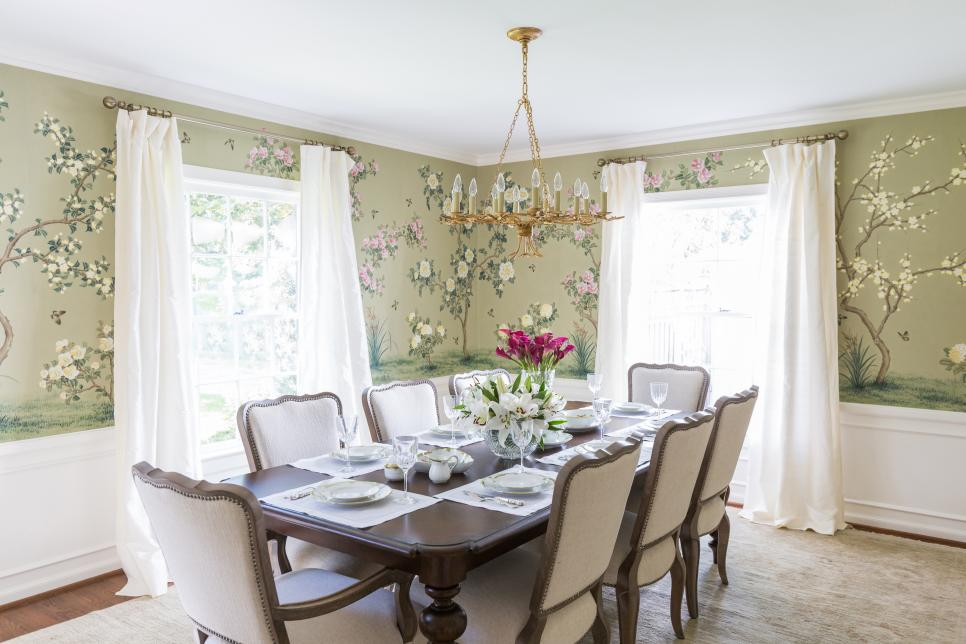
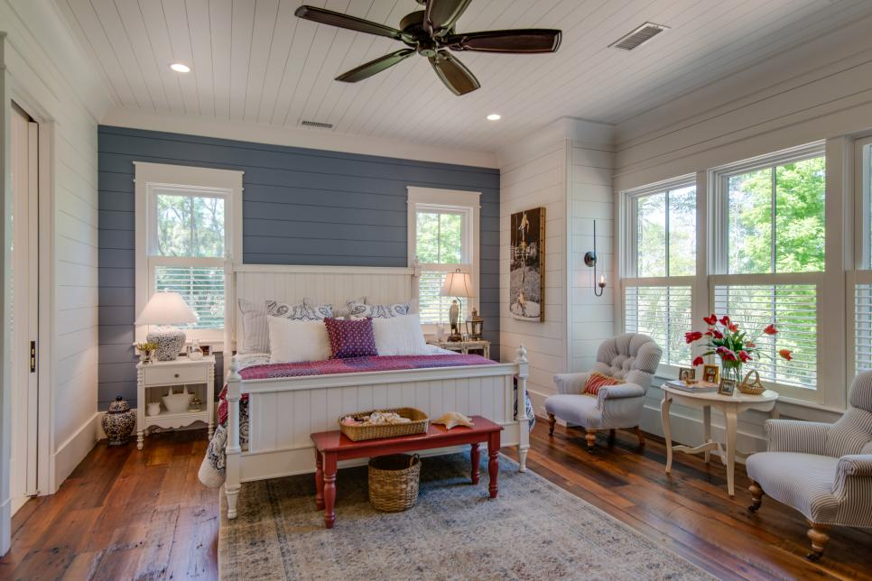

# DeCore Idea: deep learning meets interior design
Louisa Reilly

## Background:
HGTV has recruited you to create an image classifier that can discern the various common interior design styles. They have plans to use your model for a prototype recommendation engine that can give designer's clientele and their viewers recommendations on what other pieces would match their own decorations and furniture. 

## Design:
A classification model will be built using a residual network (ResNet). The model will be able to classify various furniture/ decor images into a variety of design styles. Once that is working sufficiently, I plan to build a recommendation engine that will take in a picture of a furniture piece or decoration and return suggestions that will match said item.

## Data:
Pretrained weights from the [LSUN: Construction of a Large-scale Image Dataset using Deep Learning with Humans in the Loop](https://www.yf.io/p/lsun) will be used for transfer learning.

Pinterest images obtained via webscraping with an unofficial Pinterest Image Scraper. The images are of nicely decorated interiors in the following design styles:
- **Modern**

- **Transitional**

- **Traditional**

- **Mid Century Modern**

- **Rustic**

- **Industrial**

- **French Country**

- **Scandinavian**

- **Art Deco**

- **Eclectic**

- **Shabby Chic**

- **Bohemian**

## Tools:
- Pinterest Image Scraper without the offical API from [iamatulsingh's github](https://github.com/iamatulsingh/pinterest-image-scrap)
- Image processing library OpenCV
- Visualization with Tableau and Matplotlib
- Recommendation Engine Surprise
- Neural Network Implementation: Keras
- 
## MVP:
A functioning convolutional neural network that can discern different design styles based on an image of a piece of furniture.