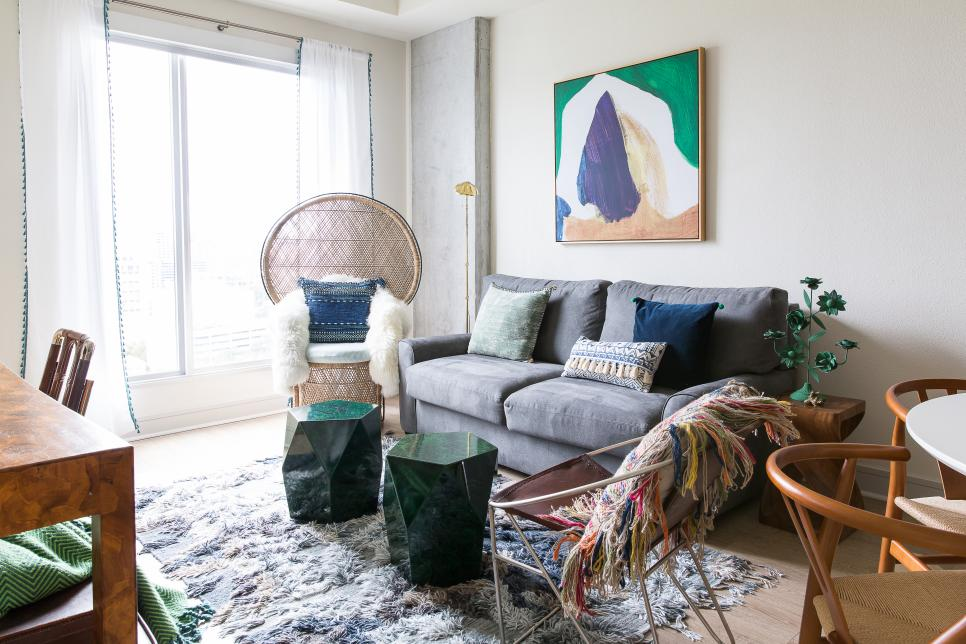

# DeCore Idea: deep learning meets interior design
Louisa Reilly

## Background:
HGTV has recruited you to create an image classifier that can discern the various common interior design styles. They have plans to use your model for a prototype recommendation engine that can give designer's clientele and their viewers recommendations on what other pieces would match their own decorations and furniture. 

## Design:
A classification model will be built using a residual network (ResNet). The model will be able to classify various furniture/ decor images into a variety of design styles. Once that is working sufficiently, I plan to build a recommendation engine that will take in a picture of a furniture piece or decoration and return suggestions that will match said item.

## Data:
Pretrained weights from the [LSUN: Construction of a Large-scale Image Dataset using Deep Learning with Humans in the Loop](https://www.yf.io/p/lsun) will be used for transfer learning.

Pinterest images obtained via webscraping with an unofficial Pinterest Image Scraper. The images are of nicely decorated interiors in the following design styles:
- **Modern:**
    - Modern refers to the time period from early to mid-20th century. It rejects the ornate flourishes of previous styles, such as Gothic, Renaissance, and Victorian styles.
    - Clean straight lines with no additional detail.
    - Chrome and stainless steel without detailing.
    - Minimalism
    - Lack of clutter. e.g. open floor plan, built-in storage etc.
    - Bold accent colors, primary colors in particular.

- **Contemporary**
    - Anything that is modern and current with the styles of today are contemporary.
    - Neutral palettes (black, white, and grey), and if color is added, the color is in it's pure form and saturated tone, such as true red, indigo, or orange.
    - Stark minimalism and open spaces.
    - Clean lines
    - Organic silhouettes
    - Features state-of-the-art materials such as glass and metals.
    

- **Transitional**
    - It combines elements of traditional and contemporary design to form a  classic and timeless style. 
    - Neutral palette (soothing neutrals, such as taupes, tans, and vanillas paired with a dark brown)
    - Minimal accessories and clutter.
    - Comfort is key
    - Fabrics are tonal and textural.
    - Balance of clean and crisp lines with softer and more rounded edges.
    - Favors modern style lighting
    

- **Traditional**

- **Rustic**

- **Industrial**

- **Scandinavian**

- **Bohemian**

## Tools:
- Pinterest Image Scraper without the offical API from [iamatulsingh's github](https://github.com/iamatulsingh/pinterest-image-scrap)
- Image processing library OpenCV
- Visualization with Tableau and Matplotlib
- Recommendation Engine Surprise
- Neural Network Implementation: Keras
- 
## MVP:
A functioning convolutional neural network that can discern different design styles based on an image of a piece of furniture.