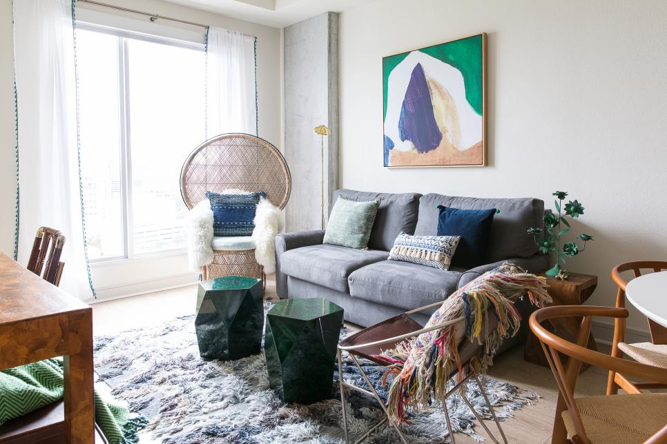
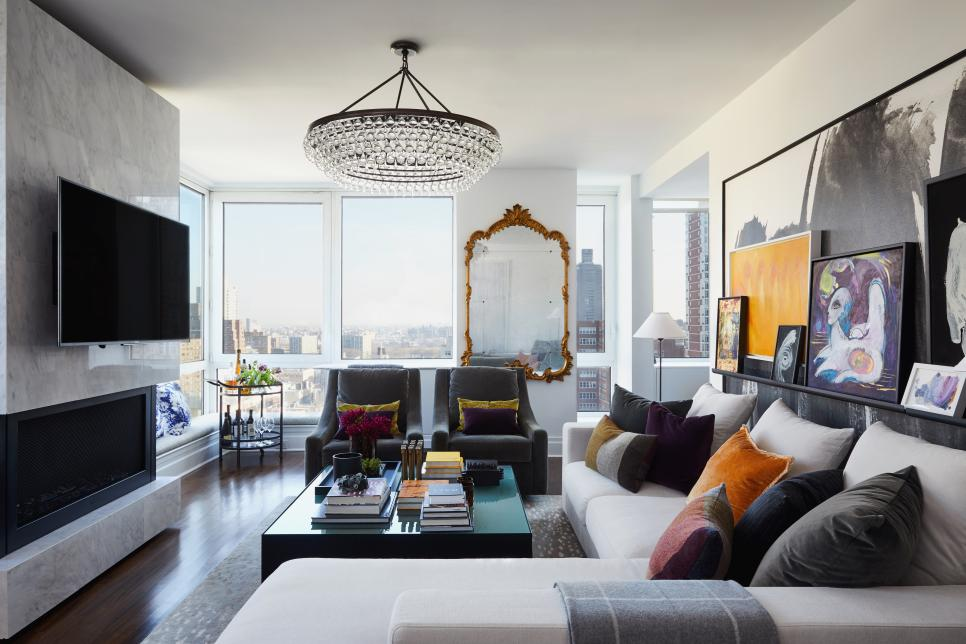
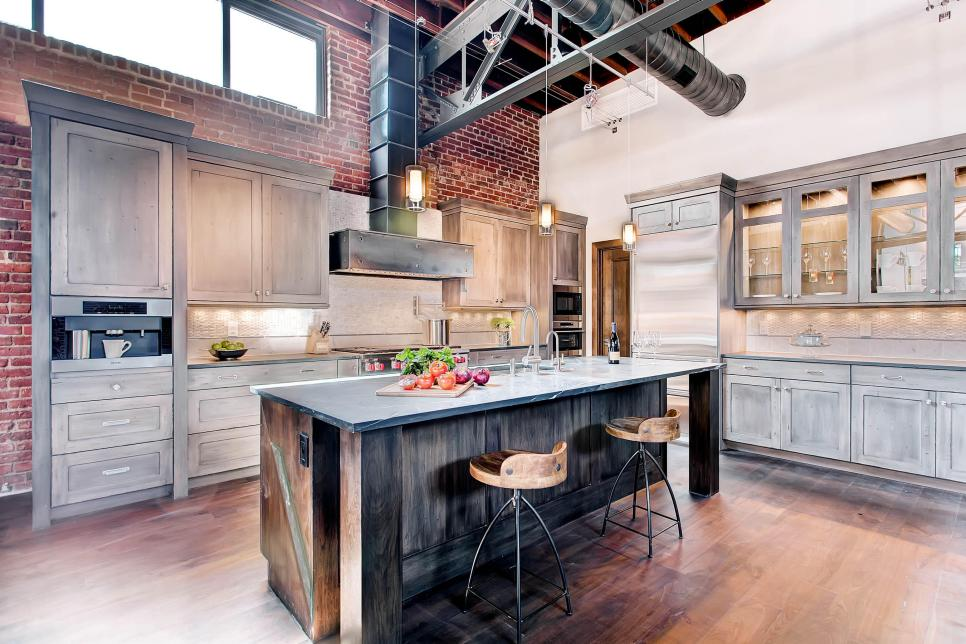
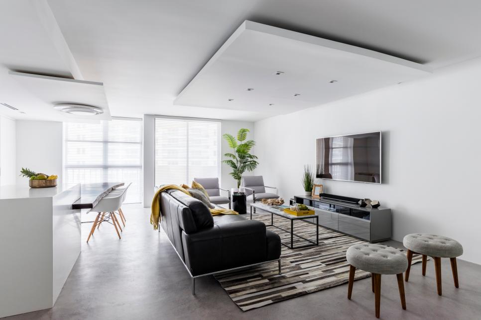
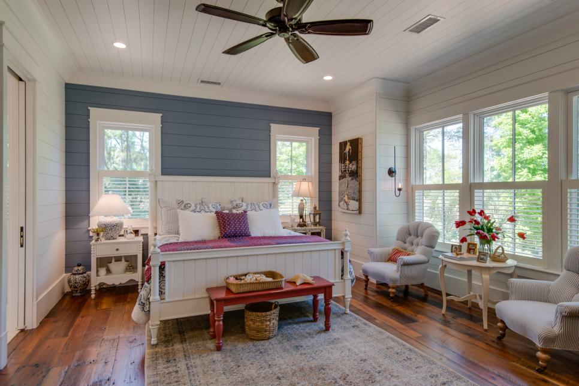
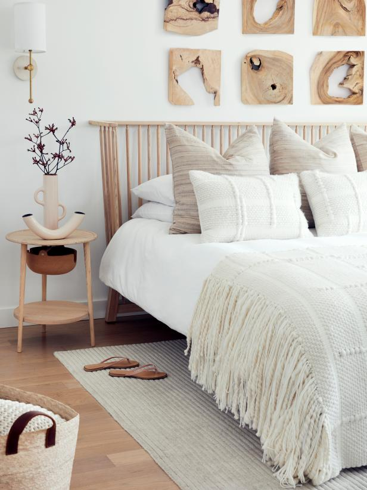
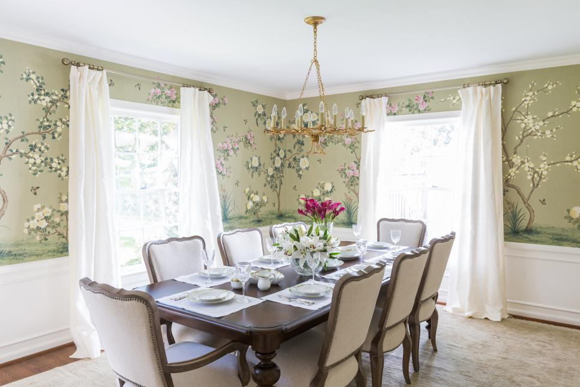
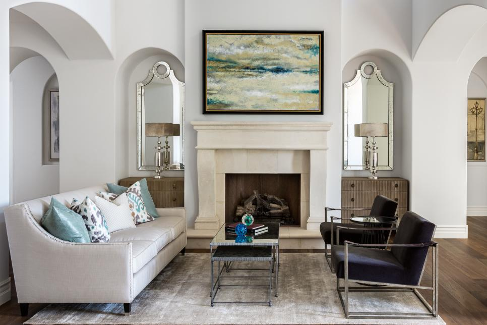

# DeCore Idea: deep learning meets interior design
Louisa Reilly

## Abstract:
Interior design styles tend to be very fluid and subjective. Thusly, interior designers and their clientele often have difficulty communicating their ideas/ vision. To help solve this problem, multiple convolutional neural network multi-classification models were built using Keras to classify pictures of home interiors into specific design style categories. The models were trained on scraped images of home interiors. Though the loss function consistently increases with each epoch, all the models have problems with overfitting. In particular, the mobilenet model appears to be mostly guessing the modern class. To prevent overfitting, more images need to be scraped. Additionally, data augmentation or using more fluid classes could improve the model's preformance.

## Background:
HGTV has recruited you to create an image classifier that can discern the various common interior design styles. They have plans to use your model for a prototype recommendation engine that can give designer's clientele and their viewers recommendations on what other pieces would match their own decorations and furniture. 

## Design:
Interior design is the process of planning out the decorations of a room or building's interior. It is considered an artform in many circles. As such, there are no stringent rules, which makes it very fluid and subjective. This makes it difficult to pinpoint styles without a solid frame of reference. Thusly, interior designers and their clientele often have difficulty communicating their ideas/ vision. To help solve this problem, multiple convolutional neural network multi-classification models were built using Keras. The goal for the model was for it to be able to distinguish between various furniture/ decor images into a variety of design styles.

## Data: 
Pretrained weights from the [Imagenet](https://image-net.org/) dataset were utilized for transfer learning. Image scraping was done using an unofficial Pinterest image scraper and unofficial Google image scraper from GitHub. There are about 300 images per class, and in total 2,420 images in the dataset. All images were of nicely decorated/ staged homes in 8 design styles:
- **Bohemian**
    - Unconventinal, carefree, and relaxed sense of style.
    - Colors tend to be warm and earthy, metallic, or jewled tones. Colors are often combined and lauered
    - Patterns and textures are commonly mixed, especially mixing of materials
    - Embraces a "more is more" philosophy
    - Tends to be cozy, cosmopolitian, and embraces the natural world.
    - Furniture is unique, so second-hand and/or vintage.
    - Lamps and lanterns are common, and so are personal accessories and potted plants.

    
- **Contemporary**
    - Anything that is trendy and current with the styles of today are contemporary.
    - Neutral palettes (black, white, and grey), and if color is added, the color is in it's pure form and saturated tone, such as true red, indigo, or orange.
    - Stark minimalism and open spaces.
    - Clean lines
    - Organic silhouettes
    - Features state-of-the-art materials such as glass and metals.

- **Industrial**
    - Reminiscent of a factory or workshop.
    - Furniture often is composed of metal, wood, or distressed leather.
    - Walls/ ceilings tend to show raw materials, such as exposed brick, metal beams, or pipes.
    - Colors tend to be dark browns, navy blues, and metallics.
    - Spaces tend to be open and with large black grid windows.
    - There can be a touch of vintage and antique pieces. 

- **Modern:**
    - Modern refers to the time period from early to mid-20th century. It rejects the ornate flourishes of previous styles, such as Gothic, Renaissance, and Victorian styles.
    - Clean straight lines with no additional detail.
    - Chrome and stainless steel without detailing.
    - Minimalism
    - Lack of clutter. e.g. open floor plan, built-in storage etc.
    - Bold accent colors, primary colors in particular.

    

- **Rustic:**
    - Defined by an element of ruggedness, e.g. wood grains or browns, beiges, or warmer shades of white.
    - Accent colors are muted, e.g. tans, reds, blues, greeens, yellows, and grays.
    - Imperfect but warm and inviting.
    - Rugged, imperfect lines, and silhouettes
    - Iron, pewter, copper, or brass fixture finishes.
    - Decor is animal hides and fur, antlers, throws, pillows, and rugs with simple motifs or patterns

- **Scandinavian:**
    - Focus on clean, simple lines, and minimalism.
    - Preserves functionality without sacrificing beauty.
    - Favors bright airy spaces.
    - Tends to incorporate elements of nature.
    - Fixtures are warm and inviting.
    - Colors are mainly neutrals, especially bright whites whit pops of black and tan, while accent colors are light colors or greens.
    

- **Traditional**
    - Traditional is inspired by the past, mainly the 18th and 19th centuries. 
    - It is normally thought to be purely influenced by European decore (England, France etc.), but it can include elements from the Mediterranean, Spanish, or Asia. 
    - Highlights natural materials, such as wood.
    - Natural colors are common, especially dark warm tones.
    - Furniture and fabrics are heavy and ornate, e.g. clawfoot tubs and carved wood or drapes and damask pillows with a trim. 
    - Strives for harmony and order, everything must "go" together
    - The devil is in the details. 

- **Transitional**
    - It combines elements of traditional and contemporary design to form a  classic and timeless style. 
    - Neutral palette (soothing neutrals, such as taupes, tans, and vanillas paired with a dark brown)
    - Minimal accessories and clutter.
    - Comfort is key
    - Fabrics are tonal and textural.
    - Balance of clean and crisp lines with softer and more rounded edges.
    - Favors modern style lighting

## Algorithms:
   - Transfer learning with pre-trained weights from image-net.
   - Neural net architectures: VGG16, MobileNet, ResNet150
   - An 80/20 train test split was utilized for training.

The baseline model used was logistic regression, and from the confusion matrix, it appears to be just randomly guessing, which explains the 11.8% accuracy. Mobilenet was overfitting even after the addition of dropout layers and L2 regularization. The highest accuracy it achieved was ~30% on the validation set and 60% on the training set. All other models hovered around a 12.5% accuracy. 

More data is needed to obtain a better functioning model, either through scraping or data augmentation. The model's preformance could significantly improve by switching to more fluid classes.  

## Tools:
   - Pinterest Image Scraper without the offical API from [iamatulsingh's github.](https://github.com/iamatulsingh/pinterest-image-scrap)
   - Google Images Download from [Joeclinton1's github.](https://github.com/Joeclinton1/google-images-download)
   - Image processing library OpenCV.
   - Visualization with Tableau and Matplotlib.
   - Neural Network Implementation: Keras and tensorflow.
   - Google Cloud and Cloud Storage for processing and data storage.